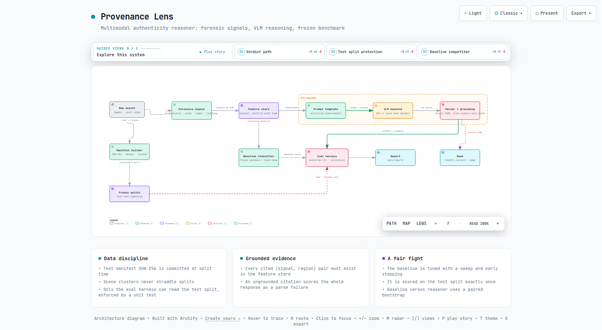
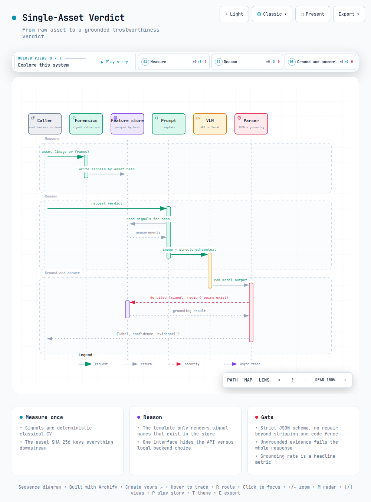

# Provenance Lens

A multimodal authenticity reasoner. Give it an image or a short video and it returns a trustworthiness verdict backed by named, checkable evidence: a vision language model reasons over forensic signals extracted with classical computer vision, and a frozen held-out benchmark measures whether that reasoning layer actually beats a well tuned classifier.

Built and maintained by [Amos Bunde](https://github.com/AmosBunde).

## Why

Most manipulation detectors output a score and nothing else. When the score is wrong there is nothing to audit, and when it is right there is nothing to learn. Provenance Lens tests a sharper hypothesis: a VLM that is shown the image together with a structured dossier of forensic measurements can match or beat a tuned discriminative baseline while producing verdicts a human can audit signal by signal.

Three commitments shape everything in this repository:

- **A frozen benchmark.** The test split is fixed at manifest time, its hash is committed, and only the evaluation harness can read it. This is enforced in code and by a unit test, not by convention.
- **A fair baseline.** The classifier the reasoner competes against gets a real learning rate sweep and early stopping before the comparison happens, and it is scored on the test set exactly once.
- **Grounded evidence.** Every signal the model cites must exist in the feature store for that exact asset. A single invented citation turns the whole response into a parse failure. Negative results, including any slice where the reasoner loses, go in the report as measured.

## Architecture

[](architecture/architecture.html)

The interactive version lives at [`architecture/architecture.html`](architecture/architecture.html), with guided views for the verdict path, the test split protection, and the baseline competitor. The diagram source is [`architecture/architecture.archify.json`](architecture/architecture.archify.json), and the rendered artifacts are regenerated from it whenever the architecture changes.

Raw assets flow through a manifest builder (SHA-256 keys, near-duplicate collapse, license recording) into scene-aware frozen splits. Independently, a forensics engine measures every asset and writes named signals to a parquet feature store keyed by the asset hash. Two consumers read that store: the baseline classifier, and the prompt template that renders measurements into structured context for the VLM. A strict parser and grounding check gate the model output before anything reaches the evaluation harness or the demo endpoint.

### How a single verdict is produced

[](architecture/verdict-sequence.html)

Interactive version: [`architecture/verdict-sequence.html`](architecture/verdict-sequence.html), source [`architecture/verdict.sequence.archify.json`](architecture/verdict.sequence.archify.json). The forensics engine measures once; the prompt template reads only signal names that exist in the store; the parser verifies every cited `(signal, region)` pair against the store before a verdict is allowed out.

## Repository layout

```
provenance-lens/
├── CONTRIBUTING.md              # development workflow conventions
├── pyproject.toml               # package metadata, dependencies, tool config
├── Makefile                     # one idempotent target per stage
├── .pre-commit-config.yaml      # ruff + black
├── .github/workflows/ci.yml     # lint + pytest on every PR
├── docker/
│   ├── Dockerfile.cpu           # development and smoke-scale stages
│   └── Dockerfile.cuda          # full-scale training and reasoning
├── configs/
│   ├── data_sources.yaml        # dataset URLs, licenses, checksums
│   ├── baseline.yaml            # backbone, head, sweep grid
│   └── reasoner.yaml            # backend selection, model ids, decoding
├── src/provenance_lens/
│   ├── data/                    # download, manifest, dedupe, splits, access guard
│   ├── forensics/               # compression, noise, edges, lighting, feature store
│   ├── baseline/                # embeddings, head, training, sweep
│   ├── reasoner/                # backend interface, prompt, parser, grounding
│   ├── video/                   # frame sampling, temporal consistency
│   ├── eval/                    # harness (sole test-split reader), metrics, calibration, report
│   └── demo/                    # FastAPI app and static page
├── tests/                       # includes the leakage-impossibility test
├── notebooks/
│   └── eda.ipynb                # written EDA findings
├── data/                        # gitignored payloads; committed split hashes only
│   └── splits/test_manifest.sha256
├── architecture/
│   ├── architecture.archify.json    # system diagram source (Archify)
│   ├── architecture.html            # interactive system diagram
│   ├── architecture.png             # rendered diagram embedded in this README
│   ├── verdict.sequence.archify.json # verdict sequence source (Archify)
│   ├── verdict-sequence.html        # interactive verdict sequence
│   └── verdict-sequence.png         # rendered diagram embedded in this README
└── docs/
    └── report/                  # generated by make eval
```

## Getting started

The development path is CPU only; the heavy stages run in the CUDA image on a rented GPU. Every stage is a single idempotent Make target, re-runnable from a clean checkout.

```bash
make setup            # install the package and dev tooling
make data             # download sources, verify checksums, build manifest and frozen splits
make features         # run all forensic extractors into the feature store
make eda              # execute the EDA notebook headlessly
make baseline-smoke   # CPU smoke run of the full baseline path
```

Full-scale stages, inside `docker/Dockerfile.cuda`:

```bash
make baseline         # learning rate sweep, freeze the best validation checkpoint
make reason           # run the VLM reasoner
make eval             # score, calibrate, generate docs/report/
make demo             # serve the single-asset verdict endpoint and page
```

| Stage | CPU machine | CUDA image |
|---|---|---|
| `setup`, `data`, `features`, `eda` | full | same |
| `baseline-smoke` | full (tiny subset, 1 epoch) | not needed |
| `baseline` | smoke only | full sweep |
| `reason` | API backend, or local backend at smoke scale | local open-weights backend |
| `eval`, `demo` | full | same |

## Data

Every dataset enters through `configs/data_sources.yaml`, which records the URL, the expected archive checksum, and the license; `make data` downloads, verifies, and extracts. Planned image sources cover splice, copy move, removal, and AI generated content (CASIA v2.0, Columbia Uncompressed Splicing, COVERAGE, and a GenImage slice with its authentic counterparts). The video path ships with a scripted smoke set: recorded manipulations (region splice, re-encode, frame duplication) applied to CC0 clips, so it is reproducible without credentials; FaceForensics++ c23 is an optional extension for anyone who supplies their own access.

The manifest builder records, per asset: the SHA-256 of the file bytes (the asset key used everywhere), source dataset, license, class label, manipulation type, resolution, and a perceptual hash. Exact and near duplicates are collapsed before splitting.

Splits are scene aware: assets are clustered by perceptual hash connected components plus any source-provided scene or camera grouping, and a cluster lives in exactly one split (70 train / 15 validation / 15 test, stratified by class and manipulation type). At split time the test manifest is serialized canonically and its SHA-256 is committed at `data/splits/test_manifest.sha256`.

**Test split protection.** `provenance_lens.data.access.load_split("test")` requires a capability token that only the harness module can construct, and the leakage-impossibility unit test asserts both the runtime guard and that no module outside `eval/` references the test manifest path. All development, EDA, feature tuning, baseline training, and prompt iteration happen on train and validation.

## Forensic signals

All extractors are deterministic classical CV (numpy, scipy, opencv, pillow) and run fine on CPU. Output lands in a parquet feature store keyed by asset SHA-256. Regions are named cells of a fixed 3x3 grid (`r0c0` through `r2c2`) plus `global`, which makes every evidence citation a checkable string.

| Family | Signals |
|---|---|
| Compression inconsistency | JPEG ghost curve across quality levels, ghost minimum location and depth per region, blocking grid periodicity strength, grid misalignment between regions |
| Noise residuals | High-pass residual statistics per region, PRNU-style noise correlation between regions, cross-region noise variance mismatch |
| Edge coherence | Edge density and gradient-orientation coherence per region, boundary discontinuity along region seams |
| Lighting | Dominant lighting direction per region (shading gradients), pairwise angular disagreement, global inconsistency score |

Each signal carries a stable snake_case name, a numeric value, its region, and a documented direction of suspicion. That schema is the vocabulary the grounding check validates against.

## The baseline

A frozen pretrained backbone produces an image embedding, which is concatenated with the standardized forensic features and fed to a trainable MLP head (PyTorch). The learning rate grid lives in `configs/baseline.yaml`; training uses early stopping on validation macro F1 and logs every run (config, seed, curves) to `runs/`. The best validation checkpoint is frozen, recorded by hash, and scored on the test split exactly once through the harness. That number is the one to beat, and it is never revisited. `make baseline-smoke` exercises the identical code path on a tiny subset so the pipeline stays verifiable on CPU.

## The reasoner

One abstract backend interface, two implementations: the Anthropic API with vision input, and a local open-weights VLM for the CUDA image. `configs/reasoner.yaml` selects the backend; nothing else in the codebase knows which one is active.

The prompt template renders the asset plus its measurements as structured context (signal name, region, value, direction of suspicion), drawn verbatim from the feature store. The model must answer with exactly one JSON object:

```json
{
  "label": "authentic | manipulated",
  "confidence": 0.87,
  "evidence": [
    {"signal": "jpeg_ghost_depth", "region": "r1c2", "direction": "supports_manipulated"}
  ]
}
```

The parser is strict: anything that is not a single schema-conforming JSON object (enum label, confidence in [0, 1], known evidence keys) is a parse failure, with no repair beyond stripping one fenced code block. The grounding check then verifies that every cited `(signal, region)` pair exists in the feature store for that asset hash; one ungrounded citation fails the whole response. The grounding rate is a headline metric of the report.

## Evaluation

- **Metrics:** accuracy, macro F1, and AUROC on the binary verdict, plus recall per manipulation type.
- **Uncertainty:** 95% bootstrap confidence intervals over 1000 resamples; the baseline versus reasoner comparison is a paired bootstrap on the same resamples.
- **Parse failures** count as incorrect predictions and are also reported as a separate rate, with grounding failures broken out.
- **Calibration:** reliability diagrams and 15-bin ECE before and after temperature scaling, with the temperature fitted on validation only.
- **Video:** uniform frame sampling, per-frame verdicts, and temporal consistency aggregation (confidence-weighted majority vote plus a flip-rate diagnostic), reported separately from stills.

`make eval` writes `docs/report/`: the results table with confidence intervals, per-type breakdowns, reliability diagrams, grounding and parse failure rates, and a written findings section that includes failure analysis. If the reasoner loses to the baseline on a slice, the report says so; nothing is ever tuned on the test set.

## Demo

`make demo` starts a FastAPI service exposing `POST /verdict` (multipart image upload, returns the reasoner JSON with evidence) and a single page that renders the verdict and highlights the cited regions. It runs on CPU with the API backend.

## Results

All six milestones are complete (28 issues, 30 merged pull requests, every one through a linked branch with green CI). The frozen benchmark stands at:

| measurement | value |
|---|---|
| Baseline test macro F1 | 0.9547 [0.9517, 0.9579] |
| Baseline test AUROC | 0.9854 [0.9837, 0.9872] |
| Baseline copy_move recall | **0.00** (109 test assets) |
| Test ECE, before and after temperature scaling | 0.0344 to 0.0024 (temperature 2.904, fitted on validation) |
| Validation-to-test gap at freeze | +0.0003 |

The headline is the negative result: the tuned baseline labels essentially every copy-moved image authentic, so its strong aggregate is a cifake separability number rather than manipulation detection in general. Full tables, per-type intervals, reliability diagrams, and written findings live in [`docs/report/`](docs/report/README.md), regenerated end to end by `make eval`.

### The one remaining step: the reasoner comparison

Every layer of the reasoner is merged and mock-validated (backend interface, golden-pinned prompt, strict parser, grounding gate, resumable cost-accounted batch runner), but no real model call has been made because API credentials were not available during development. With a key, the comparison runs in three commands:

```bash
export ANTHROPIC_API_KEY=...          # then set backend: anthropic in configs/reasoner.yaml
make reason                            # validation split, resumable, cost-logged
python3 -c "from provenance_lens.eval.harness import reason_on_test; reason_on_test()"
make eval                              # regenerates docs/report/ with the paired comparison
```

Measured cost basis: roughly 2,000 prompt tokens plus a compressed image per asset, about 0.011 USD per asset at claude-sonnet-5 rates (about 200 USD per full 18,000-asset split; a stratified subsample or claude-haiku-4-5 reduce this). The report generator automatically adds the paired bootstrap delta, grounding rate, and per-type comparison the moment `data/verdicts/test.jsonl` exists; given the baseline's copy_move failure, that slice is where grounded regional evidence has its real opportunity.

## Roadmap (complete)

| Milestone | Outcome |
|---|---|
| **M0 Scaffold** | Package, Makefile, pre-commit, CI, both docker images; all green |
| **M1 Data and EDA** | 120,309-asset manifest, frozen splits (test hash committed), leakage guard enforced in code, EDA findings: residual energy separates within source, file size is a shortcut, quality factor is a source fingerprint |
| **M2 Forensics** | Four extractor families, 16.1 M store rows, 134 signals per asset |
| **M3 Baseline** | Tuned (flat sweep grid, representation-limited), frozen by hash, scored on test exactly once |
| **M4 Reasoner** | Full chain merged and mock-validated; real inference credential-gated as above |
| **M5 Eval, calibration, video** | Scorer with paired bootstrap, calibration with validation-only fitting, video sampling and temporal aggregation, report generator, hardened demo |

## Contributing

Development is issue first: every change starts as a labeled issue, lands through a branch linked to that issue, and merges through a reviewed pull request with green CI. The conventions, from commit style to the review cadence, live in [CONTRIBUTING.md](CONTRIBUTING.md).
